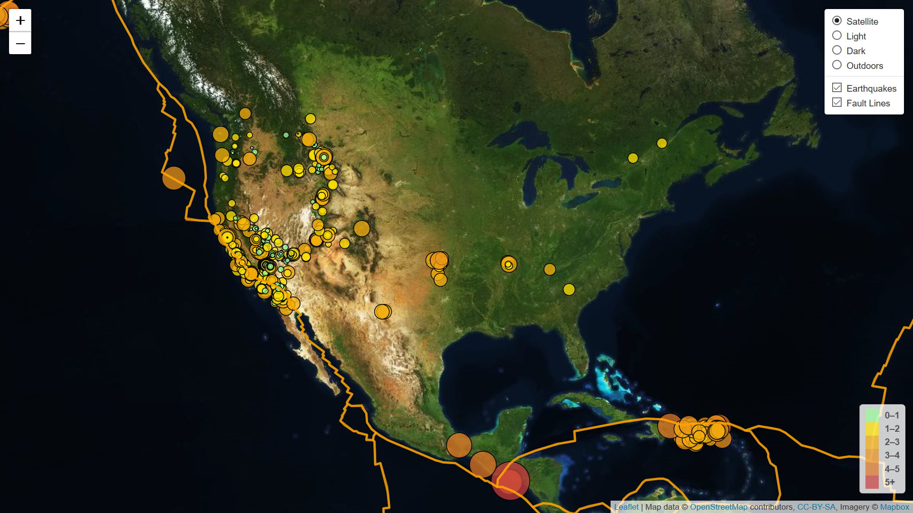
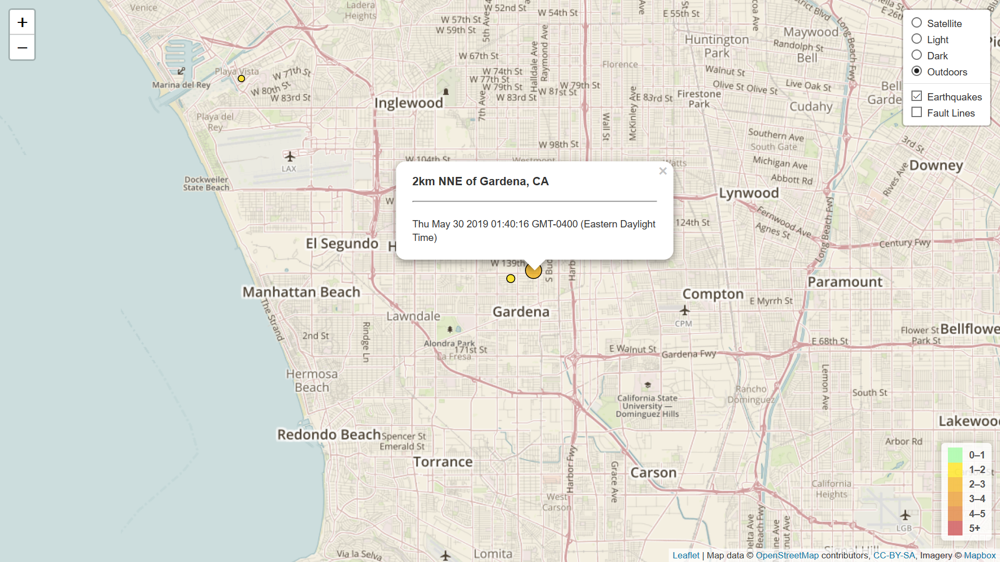

In this project, leaflet and geoJSON were used to display a map containing recent earthquake activity and tectonic plates.

## Javascript Code

``` javascript

// Store the API endpoint as queryURLs
// The variable API_KEY in the config file stores the API key
var queryEarthquake_URL = "https://earthquake.usgs.gov/earthquakes/feed/v1.0/summary/all_week.geojson";
var queryPlate_URL = "PB2002_plates.json";

// Perform a GET request to the query URLs
d3.json(queryPlate_URL, function(dataPlates) {

	d3.json(queryEarthquake_URL, function(data) {
		// Using the features array sent back in the API data, create GeoJSON layers and add them to the map
		createFeatures(data.features, dataPlates.features);
	});
});

// Function to determine marker size based on magnitude
function markerSize(magnitude) {
	return magnitude * 4;
}

// Function to determine marker color based on magnitude
function colorMagnitude(magnitude) {

	var magnitudeColor = "";

	if (magnitude <= 1) {
		magnitudeColor = "#98FB98";
	}
	else if (magnitude <= 2) {
		magnitudeColor = "#FFE200";
	}
	else if (magnitude <= 3) {
		magnitudeColor = "#F3AE0C";
	}
	else if (magnitude <= 4) {
		magnitudeColor = "#E89219";
	}
	else if (magnitude <= 5) {
		magnitudeColor = "#DD7525";
	}
	else {
		magnitudeColor = "#C73D3F";
	}
	
	return magnitudeColor;
}

// Function to create map features
function createFeatures(earthquakeData, plateData) {

	// Popup labels for tectonic plate data
	function onEachPlateFeature(feature, layer) {
		layer.bindPopup("<h3>" + feature.properties.Code +
			"</h3><hr><p>" + feature.properties.PlateName + "</p");
	}

	// Popup labels for earthquake data
	function onEachFeature(feature, layer) {
		layer.bindPopup("<h3>" + feature.properties.place +
			"</h3><hr><p>" + new Date(feature.properties.time) + "</p");
	}

	// Marker settings for earthquakes
	function earthquakeMarkers (feature, latlng) {

		var geojsonMarkerOptions = {
			fillOpacity: 0.75,
			opacity: 1,
			fillColor: colorMagnitude(feature.properties.mag),
			color: "#000000",
			weight: 1,
			radius: markerSize(feature.properties.mag)
		};
		
        return L.circleMarker(latlng, geojsonMarkerOptions);
	}

	var plateStyle = {
		"color": "#FFA500",
		"weight": 3,
		"opacity": 0.65,
		"fillOpacity": 0
	};

	var earthquakes = L.geoJSON(earthquakeData, {
		onEachFeature: onEachFeature,
		pointToLayer: earthquakeMarkers
	});
	
	var fault_lines = L.geoJSON(plateData, {		
		onEachFeature: onEachPlateFeature,
		style: plateStyle
	});

	createMap(earthquakes, fault_lines);
	
}

// Function to create the map
function createMap(earthquakes, fault_lines) {

	// Define satellitemap, lightmap, darkmap, and outdoorsmap layers
	var satellitemap = L.tileLayer("https://api.tiles.mapbox.com/v4/{id}/{z}/{x}/{y}.png?access_token={accessToken}", {
	  attribution: "Map data &copy; <a href=\"https://www.openstreetmap.org/\">OpenStreetMap</a> contributors, <a href=\"https://creativecommons.org/licenses/by-sa/2.0/\">CC-BY-SA</a>, Imagery © <a href=\"https://www.mapbox.com/\">Mapbox</a>",
	  maxZoom: 18,
	  id: "mapbox.satellite",
	  accessToken: API_KEY
	});

	var lightmap = L.tileLayer("https://api.tiles.mapbox.com/v4/{id}/{z}/{x}/{y}.png?access_token={accessToken}", {
	  attribution: "Map data &copy; <a href=\"https://www.openstreetmap.org/\">OpenStreetMap</a> contributors, <a href=\"https://creativecommons.org/licenses/by-sa/2.0/\">CC-BY-SA</a>, Imagery © <a href=\"https://www.mapbox.com/\">Mapbox</a>",
	  maxZoom: 18,
	  id: "mapbox.light",
	  accessToken: API_KEY
	});

	var darkmap = L.tileLayer("https://api.tiles.mapbox.com/v4/{id}/{z}/{x}/{y}.png?access_token={accessToken}", {
	  attribution: "Map data &copy; <a href=\"https://www.openstreetmap.org/\">OpenStreetMap</a> contributors, <a href=\"https://creativecommons.org/licenses/by-sa/2.0/\">CC-BY-SA</a>, Imagery © <a href=\"https://www.mapbox.com/\">Mapbox</a>",
	  maxZoom: 18,
	  id: "mapbox.dark",
	  accessToken: API_KEY
	});

	var outdoorsmap = L.tileLayer("https://api.tiles.mapbox.com/v4/{id}/{z}/{x}/{y}.png?access_token={accessToken}", {
	  attribution: "Map data &copy; <a href=\"https://www.openstreetmap.org/\">OpenStreetMap</a> contributors, <a href=\"https://creativecommons.org/licenses/by-sa/2.0/\">CC-BY-SA</a>, Imagery © <a href=\"https://www.mapbox.com/\">Mapbox</a>",
	  maxZoom: 18,
	  id: "mapbox.outdoors",
	  accessToken: API_KEY
	});

	// Define a baseMaps object to hold base layers
	var baseMaps = {
	  "Satellite": satellitemap,
	  "Light": lightmap,
	  "Dark": darkmap,
	  "Outdoors": outdoorsmap
	};

    // Create overlay object to hold overlay layers
	var overlayMaps = {
		"Earthquakes": earthquakes,
		"Fault Lines": fault_lines
	};
	
	// Create a new map
	var myMap = L.map("map", {
		center: [
			37.09, -95.71
		],
		zoom: 5,
		layers: [satellitemap, earthquakes]
	});


	
	// Create a layer control containing the baseMaps and
	// add an overlay Layer containing the earthquake GeoJSON
	L.control.layers(baseMaps, overlayMaps, {
		collapsed: false
	}).addTo(myMap);


	// Create the legend
	var legend = L.control({position: "bottomright"});

	legend.onAdd = function(map) {
		var div = L.DomUtil.create("div", "info legend"),
			magnitudeNumbers = [0, 1, 2, 3, 4, 5],
			labels = [];

		for (var i = 0; i < magnitudeNumbers.length; i++) {
			var from = magnitudeNumbers[i];
			var to = magnitudeNumbers[i + 1];

			labels.push(
				"<i style='background:" + colorMagnitude(from + 1) + "'></i> " +
				from + (to ? "&ndash;" + to : "+"));
		}

		div.innerHTML = labels.join('<br>');

		return div;

	};

	// Add the legend to the map
	legend.addTo(myMap);
}

```

## Map Images



